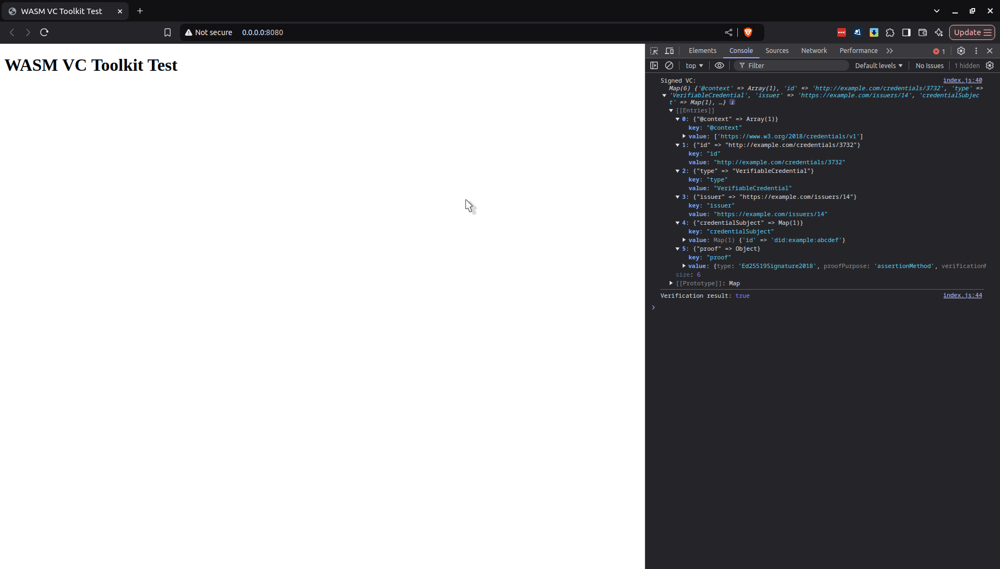

# Verifiable Credential Toolkit

Tools and Library for Verifiable Credential creation and signing.

# CLI Tools

## `vc_signer` (cargo default-run)

```
A CLI tool for signing Verifiable Credentials

Usage: vc_signer <COMMAND>

Commands:
  sign  Sign a verifiable credential
  help  Print this message or the help of the given subcommand(s)

Options:
  -h, --help     Print help
  -V, --version  Print version
```

```
Sign a verifiable credential

Usage: vc_signer sign [OPTIONS] --input-vc <INPUT_VC> --key <KEY>

Options:
  -i, --input-vc <INPUT_VC>      Path to the unsigned VC JSON file
  -k, --key <KEY>                Path to the private key file
  -o, --output-vc <OUTPUT_VC>    Path to save the signed VC [default: signed_output.json]
  -s, --schema <SCHEMA>          Optional schema file path for validation
  -u, --schema-url <SCHEMA_URL>  Optional schema URL for validation
  -h, --help                     Print help
```

## `generate_keys`

```
Generates Ed25519 key pairs

Usage: generate_keys [OPTIONS]

Options:
  -o, --output <OUTPUT>  Output directory for the keys [default: .]
  -h, --help             Print help
  -V, --version          Print version
```

# WASM Compilation and Usage

You can compile the sign and verify functions for WASM like so:

```
wasm-pack build --target web
```

By default it will build in the `pkg` directory.

I have put an example usage of the WASM functionality in the browser inside the [./wasm_js_example_usage directory](./wasm_js_example_usage). 

If you compile it inside that directory in a directory called pkg like so:

```
wasm-pack build --target web --out-dir wasm_js_example_usage/pkg
```

Then run the web server at localhost 8080 with:

```
python3 -m http.server 8080
```

When you load the page in a browser and open the console you should see the signed VC object being logged and the successful result of the verification. See screenshot below:



The load_keys.mjs Node.js script can be used to print a private and public key to the command line in a format which can be copied into the index.js file for testing/example usage purposes.